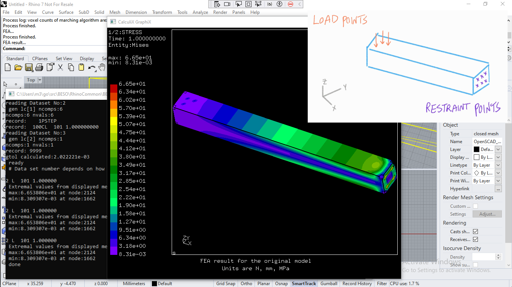

# BESO 

A Rhino3D plugin sponsored by [Nano3DTech](https://nano3dtech.com/).

# Installation

Simply visit the [plugin page](https://www.food4rhino.com/en/app/beso). Then log in and push the `install` button in front of latest released version. Or alternatively, do these:

1. Use `_PackageManager` command on Rhino3D commandline.
1. Search for plugin name i.e. `BESO`.
1. The plugin will be listed through the package manager UI.
1. Click the install button.

# How to use it

Once the plugin is installed, its commands can be accessed by typing the plugin name on command line. Start typing `BESO` on Rhino3D command line to auto complete the plugin commands.

## User guide

A future video will demonstrate how to use the plugin commands after installation.

## Screenshots

# Why this plugin?

An in-depth description of BESO and its capabilities are available on the [wiki](https://github.com/calculix/beso/wiki/Basic-description).

# Commands

This plugin offers a `BESOTopologyOptimization` command to optimize usage process. Making sure your 3D model has maximum strength and minimum weight[^1].

## `BESOTopologyOptimization` command

This command helps you optimize the toplogy of 3D model[^1]. You can keep the model strength while decreasing its weight. The finite element analysis - FEA - along with topology optimization are the technologies under the hood. FEA will be done according to user-selected loads and restraints. An optimized 3D model will be generated. Some elements of the original 3D model are removed without affecting the required strength.

When its development is finished, it will provide an alternative for what Frustum does. The figure below is taken from Frustum.

[^1]: This command is not available yet. It's being developed.
